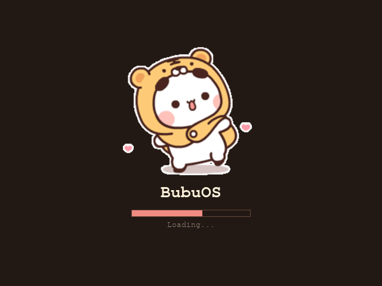
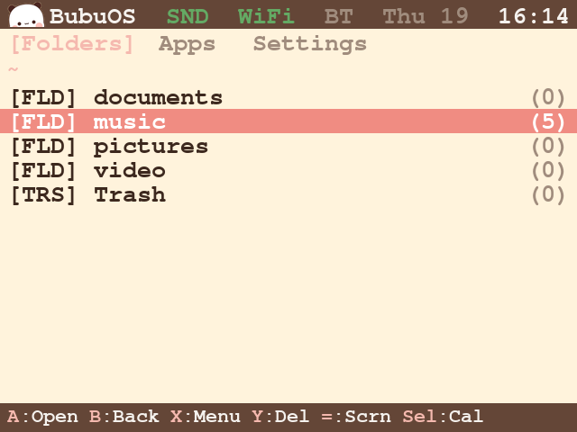
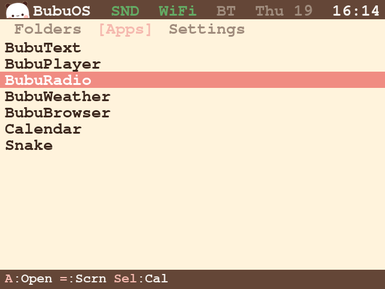
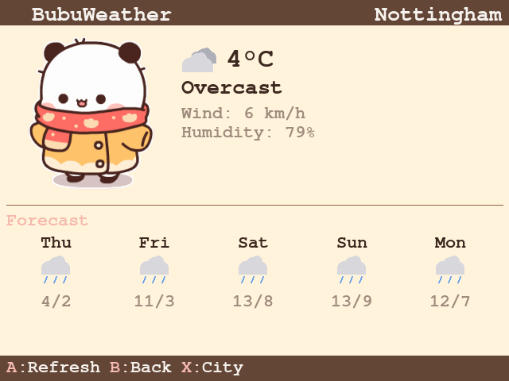
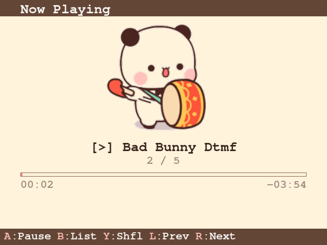
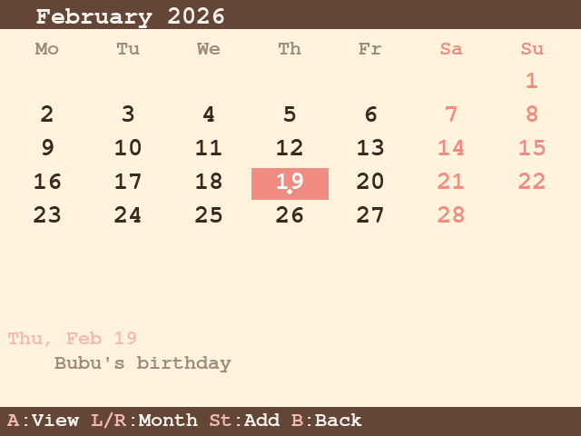
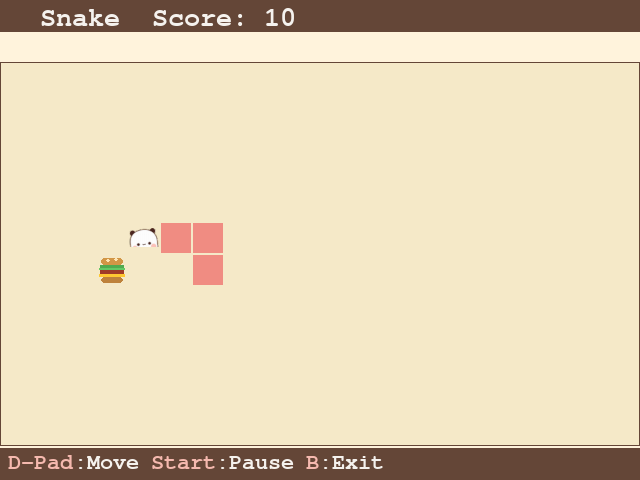

# BubuOS

A cute pocket operating system built with love for the [GPi Case 2](https://retroflag.com/gpi_case_2.html).

BubuOS is a custom DOS-like shell for Raspberry Pi CM4, written in Python + pygame. It runs on a 640x480 DPI LCD with 10-button gamepad input — no keyboard, no mouse, no touchscreen. Just a tiny console in your pocket.



## Features

- **File Browser** — navigate folders, open files, delete with confirmation
- **Music Player** — plays MP3/FLAC/OGG with animated Bubu sprites and progress bar
- **Weather** — current weather and 5-day forecast with cute Bubu in seasonal outfit
- **Calendar** — month view with events organizer, to-do checkmarks
- **Snake** — classic snake game where Bubu eats burgers
- **Text Editor** — on-screen QWERTY keyboard for notes
- **Web Radio** — internet radio player
- **Image Viewer** — full-screen image viewer with folder navigation
- **Bluetooth Audio** — pair and connect BT speakers
- **WiFi Manager** — scan and connect to networks
- **System Info** — CPU, RAM, storage, network, temperature
- **Sound Effects** — procedurally generated music-box UI sounds
- **Screenshots** — capture the screen with a button press

## Screenshots

| Files | Apps | Weather |
|-------|------|---------|
|  |  |  |

| Music Player | Calendar | Snake |
|-------------|----------|-------|
|  |  |  |

## Hardware

- [GPi Case 2](https://retroflag.com/gpi_case_2.html) — the shell (screen + buttons + battery)
- [Raspberry Pi CM4 Lite](https://www.raspberrypi.com/products/compute-module-4/) — 2GB RAM, Wireless
- microSD card (any size, 8GB+ recommended)

## Stack

- Raspberry Pi OS Lite (Debian 13, no desktop)
- Python 3 + pygame 2 (SDL2)
- X11 via `xinit` (not kmsdrm — due to a vc4-fkms-v3d async page flip bug)
- PipeWire + WirePlumber for Bluetooth audio
- Systemd service for auto-start

## Install

### Quick setup (recommended)

1. Flash **Raspberry Pi OS Lite (64-bit)** to a microSD card
2. Boot, log in, and clone this repo:
   ```bash
   git clone https://github.com/xtwoitx/bubuos.git ~/bubuos
   ```
3. Run the setup script (replace `pi` with your username if different):
   ```bash
   sudo bash ~/bubuos/setup/setup.sh pi
   ```
4. Reboot:
   ```bash
   sudo reboot
   ```

BubuOS will start automatically on boot. Use the built-in WiFi Manager app to connect to your network.

### Manual setup

1. Flash **Raspberry Pi OS Lite (64-bit)** to a microSD card
2. Copy the `bubuos/` directory to `/home/<user>/bubuos/`
3. Install dependencies:
   ```bash
   sudo apt install python3-pygame xserver-xorg-core xinit \
       pipewire pipewire-pulse wireplumber libspa-0.2-bluetooth \
       network-manager bluez
   ```
4. Allow non-root X server:
   ```bash
   echo -e "allowed_users=anybody\nneeds_root_rights=yes" | sudo tee /etc/X11/Xwrapper.config
   ```
5. Install the systemd service (replace `<user>` with your username):
   ```bash
   sed "s/YOUR_USER/<user>/g" setup/bubuos.service | sudo tee /etc/systemd/system/bubuos.service
   sudo systemctl enable bubuos
   sudo reboot
   ```

## The Story

Bubu and Dudu are two characters that helped me through a tough time. Building a tiny OS for them — giving them a home they can live in, play music, check the weather, and eat burgers — turned into a project that brought me back to life. This is that project.

## License

MIT
